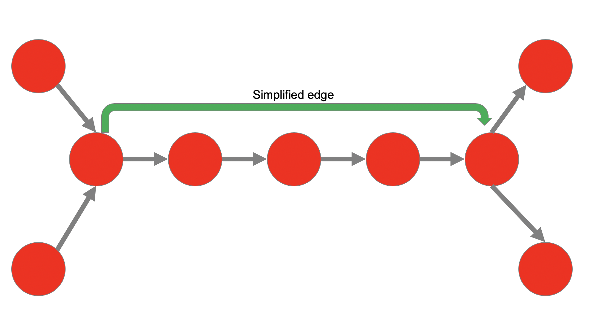

## Constructing a Global Fossil Fuel Supply Chain Graph

This repository contains a pipeline and various scripts to construct a graph of the global fossil fuel supply chain.

### Usage
#### Running the pipeline
1. Install the requirements: `pip install -r requirements.txt`
2. Download the data from PLACEHOLDER FOR DATA HOSTING and place them in the `data` directory.
3. Make sure your current working directory is at the root of this project.
4. Execute the pipeline using `kedro run`. For more information on how to run the pipeline, see the [Kedro Docs](https://kedro.readthedocs.io/en/stable/).

As some of the data files are quite big, we recommend having around 50GB of RAM available. The pipeline will write a set of 
CSV files to the `results/output` folder. These files are pre-formatted to be used with the Neo4j importer.

### Importing files into Neo4j
1. [Install neo4j server](https://neo4j.com/docs/operations-manual/current/installation/linux/). We use Neo4j 3.5 in our experiments, 
but everything described here should also work with Neo4j 4.0
2. Make sure Neo4j is shut down. The installer might start up neo4j under a different user (e.g. Neo4j). 
In this case, you might want to find the process under which Neo4j runs using `sudo ps -a | grep neo4j`. Find the PID of the process and kill it using `sudo kill`.
3. As Neo4j's files may be restricted, you want to do the next steps as root.
4. Delete Neo4j's data folder from the old database. On Linux, this is stored under `/var/lib/neo4j/data`.
5. Import the data by executing the `import.sh` script, which you can find under `src/neo4j_commands` in this repository.
6. After the import is complete, restart Neo4j using `neo4j start`

After import, you should see a message like this. The raw graph has about 11 million nodes and 20.6 million relationships.

### Simplifying the graph
The graph construction pipeline treats each segment edge as a separate node. 
This creates a lot of pipeline and railway nodes which are not needed for most analysis. To simplify the graph, we have provided a set of simplification queries.
Once you have imported the data into Neo4j and launched the database, run the Cypher queries in `src/neo4j_commands/graph_simplification.cypher` one by one. 
The graph simplification will create a direct relationship between railway and pipeline nodes which are otherwise connected through a string of segments. 
Afterwards, the individual nodes and relationships making up the segments can be deleted.
